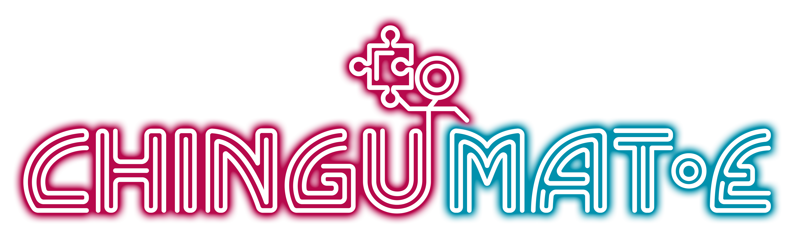
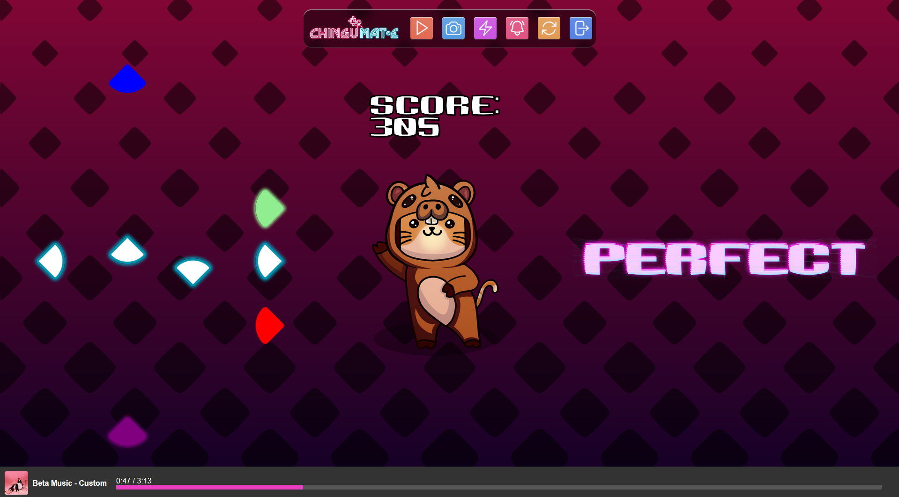

<div align="center">



*A captivating rhythm-based game with GPIO support for Raspberry Pi.*

  
*(Above: Game preview, Game Tester: Franzi Tigges)*

</div>


## Introduction

**Chingumate** is an interactive rhythm-based game designed to work with web browsers and hardware inputs via GPIO pins on a Raspberry Pi. The game leverages foot buttons made from lightweight aluminum puzzle mats, making it easy to transport in a backpack. Perfect for gaming enthusiasts and developers!

---

## Table of Contents

1. [Introduction](#introduction)
2. [Features](#features)
3. [Hardware Overview](#hardware-overview)
4. [Screenshots](#screenshots)
5. [Getting Started](#getting-started)
6. [How to Run](#how-to-run)
7. [Technologies Used](#technologies-used)
8. [Contributing](#contributing)
9. [Extra: The Tale of Chingubara](#extra-the-tale-of-chingubara)
10. [License](#license)

---

## Features

- 🎶 **Rhythm-based gameplay** synchronized with music.
- 🎮 **Foot button controls** via GPIO pins on a Raspberry Pi.
- ✨ **Custom animations and original character poses**.
- 🧳 **Portable setup**: Puzzle mats serve as lightweight, easy-to-carry foot buttons.

---

## Hardware Overview


Chingumate uses the following hardware:

- **Aluminum puzzle mats**: Function as foot buttons for gameplay.
- **Raspberry Pi**: Central hub for GPIO processing.
- **Cables**: Minimal setup for quick deployment.
- **Portable design**: Lightweight and easy to transport in a backpack.

---

## Screenshots

### Character Animation
The original character is a cat in a capybara costume, called **Chingubara**. Dancing is the only thing that makes him happy, but he doesn't like to dance alone. For more about the lore, see [The Tale of Chingubara](#extra-the-tale-of-chingubara)!


### Game Interface


---

## Getting Started

### Prerequisites

1. **Hardware Setup**:
   - Puzzle mats with aluminum contacts as foot buttons
   - Raspberry Pi with GPIO pins and cables to connect

2. **Software Setup**:
   - Raspberry Pi running Python 3
   - Install required Python libraries:
     ```bash
     pip install flask flask-cors gpiozero
     ```

3. Any modern web browser.

---

## How to Run

### Step 1: Clone the Repository

```bash
git clone https://github.com/yourusername/chingumate.git
cd chingumate
```

## Step 2: Set Up the Raspberry Pi

- Connect the foot button GPIO pins as follows:
  - **Button 1 (Left)**: GPIO 12
  - **Button 2 (Up)**: GPIO 16
  - **Button 3 (Down)**: GPIO 20
  - **Button 4 (Right)**: GPIO 21

### Step 3: Start the Server

Run the Python script to monitor GPIO states and serve data to the web interface:

```bash
python3 gpio_server.py
```

### Step 4: Start the Local Web Server

Serve the game files using a simple Python HTTP server:

```bash
python3 -m http.server 8000
```

### Step 5: Play the Game

1. Access the game in your browser from your PC:
   ```
   http://<raspberry-ip>:8000/source-code/game.html
   ```

2. Step on the foot buttons to match the rhythm (or alternatively use the arrow keys on the PC's keyboard) and enjoy the game!

## Technologies Used

- **Frontend**: HTML, CSS, JavaScript
- **Backend**: [Flask](https://flask.palletsprojects.com/) (Python)
- **Hardware**: Raspberry Pi, GPIO-connected aluminum puzzle mats
- **Design**: Neon-inspired UI, custom animations, original character

---

## Contributing

I welcome contributions! To contribute:

1. Fork the repository.
2. Create a new branch (`feature/my-feature`).
3. Commit changes (`git commit -m 'Add my feature'`).
4. Push to the branch (`git push origin feature/my-feature`).
5. Open a pull request.

---

## Extra: The Tale of Chingubara

Once upon a time, there was a cat named Chingu, known for its wild spirit and love for music. Chingu roamed the forests of the Capybara Kingdom, where creatures lived in harmony and celebrated life with music and dancing. Among them was Neko, a gentle and kind capybara who became Chingu's closest friend.

They were an inseparable pair, Chinu brought the energy, mischief and rhythm, while Neko grounded everything with wisdom and support. Together, they danced under the moonlight, their movements syncing perfectly, creating rhythms so good, that even the stars seemed to twinkle in time.

### The Day the Music Stopped

One fateful night, a terrible storm swept through the kingdom, tearing their world apart. The rivers swelled, the forests were flooded, and Chingu and Neko were separated. When the storm cleared, Neko was gone, leaving Chingu heartbroken and alone. Without Neko, the world felt muted, and Chingu stopped dancing.

Months passed, and one day, Chingu stumpled upon something extraordinary, Neko's favorite dancing mat, where they had often danced together. Moved by the memories of joy, Chingu crafted a costume from the mat, transforming it into a capybara disguise to keep Neko's spirit close forever.

### The Rhythm Lives On

This wasn't just a simple costume. As Chingu made the capybara suit, something magical happened. Neko's essence, full of rhythm and warmth, awakened with it. This time, stronger and clearer than ever.

Now, as **Chingubara, the cat in a capybara costume**, Chingu dances not just for joy but to honor Neko's memory. Chingubara's mission is to keep the music alive, seeking partners to join in the rhythm and ensure that **no one has to dance alone**, just as Neko once did for Chingu.

### The Legend Grows

They say Chingubara never dances alone. As each new dancer steps in, the beat grows stronger, as if the universe itself is listening. The legend whispers, that when enough hearts join together in the perfect rhythm, the spirit of Neko will return for one final, cosmic dance. Until then, Chingubara keeps moving each step a call to those who are ready to dance, and to never let the music end.

---

## License

This project is licensed under the MIT License. See the [LICENSE](LICENSE) file for details. Please note the important notice about the logo and original character in the License file.
